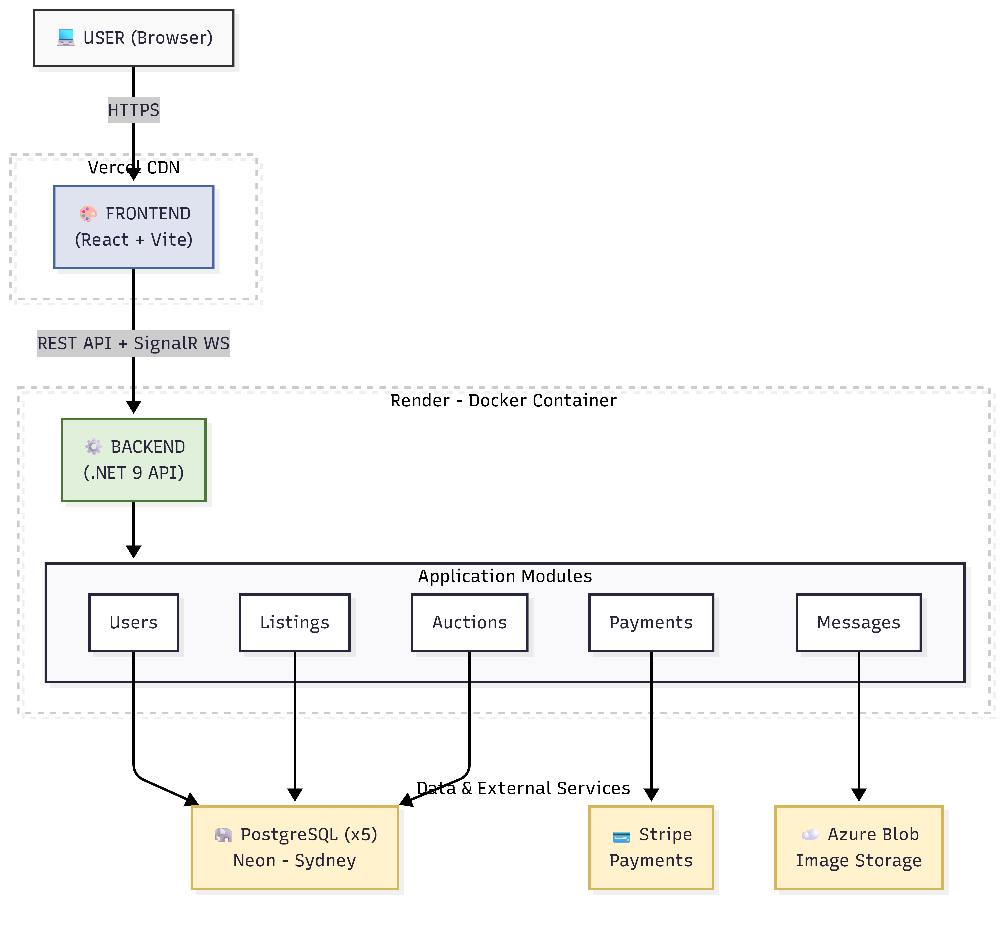
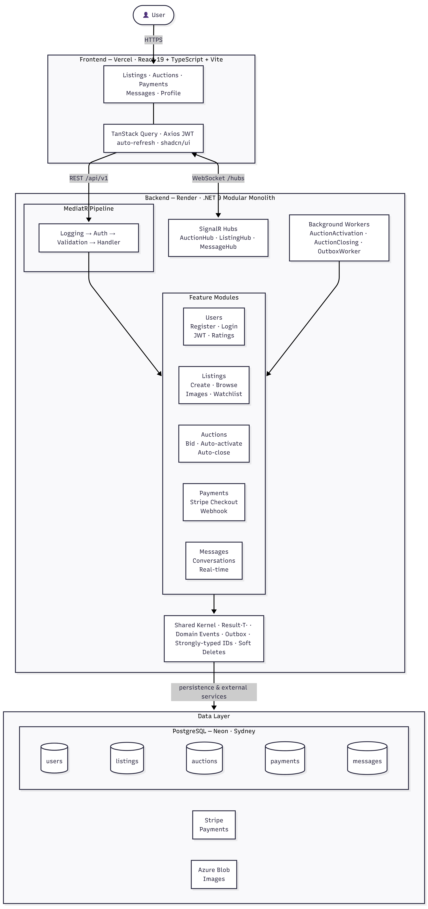

# KiwiDeal

A full-stack marketplace platform for buying, selling, and auctioning items — built with a .NET 9 modular monolith backend and a React 19 frontend.

**Live:** https://kiwi-deal.vercel.app

---

## Features

- Browse and post fixed-price listings or auction-style listings
- Real-time bidding with automatic bid-extension logic (snipe protection)
- Stripe-powered checkout for both buy-now and auction wins
- Real-time messaging between buyers and sellers
- User profiles with ratings and reviews
- Watchlist to track favourite listings
- Image uploads via Azure Blob Storage
- JWT authentication with silent token refresh

---

## Architecture

### Overview



### Detailed



---

## Tech Stack

| Layer        | Technology                                            |
| ------------ | ----------------------------------------------------- |
| Frontend     | React 19, TypeScript, Vite, Tailwind CSS 4, shadcn/ui |
| State / Data | TanStack Query, Axios                                 |
| Real-time    | SignalR (WebSockets)                                  |
| Backend      | .NET 9, ASP.NET Core, MediatR, FluentValidation       |
| Architecture | Modular Monolith, Clean Architecture, CQRS, DDD       |
| Auth         | JWT (access + refresh tokens)                         |
| Database     | PostgreSQL 17 via Neon (schema-per-module)            |
| ORM          | Entity Framework Core with EF Migrations              |
| Storage      | Azure Blob Storage                                    |
| Payments     | Stripe (Checkout Sessions + Webhooks)                 |
| Hosting      | Vercel (frontend), Render (backend), Neon (DB)        |

---

## Project Structure

```
kiwiDeal/
├── src/
│   ├── kiwiDeal.Api/                  # Composition root — entry point, hubs, middleware
│   ├── SharedKernel/                  # Result pattern, domain events, outbox, base entities
│   └── Modules/
│       ├── Users/                     # Auth, profiles, ratings
│       ├── Listings/                  # Fixed-price listings, images, watchlist
│       ├── Auctions/                  # Bidding, auction lifecycle, background workers
│       ├── Payments/                  # Stripe integration, webhook handling
│       ├── Messages/                  # Conversations, real-time delivery
│       └── Notifications/             # (planned)
└── frontend/
    └── src/
        ├── features/                  # auth, listings, auctions, payments, messages, profile
        └── shared/                    # API client, components, hooks, types
```

Each module follows Clean Architecture layers:

```
Module/
├── kiwiDeal.[Module].Api/             # Controllers, request DTOs, DI registration
├── kiwiDeal.[Module].Application/     # Commands, queries, handlers, validators
├── kiwiDeal.[Module].Domain/          # Entities, value objects, repository interfaces
└── kiwiDeal.[Module].Infrastructure/  # EF DbContext, migrations, repository impls
```

---

## Local Development

### Prerequisites

- .NET 9 SDK
- Node.js 20+
- PostgreSQL (or a Neon connection string)
- Azure Storage account (or Azurite for local emulation)
- Stripe account (test mode)

### Backend

```powershell
$env:ConnectionStrings__UsersConnection    = "Host=...;Database=neondb;Search Path=users"
$env:ConnectionStrings__ListingsConnection = "Host=...;Database=neondb;Search Path=listings"
$env:ConnectionStrings__AuctionsConnection = "Host=...;Database=neondb;Search Path=auctions"
$env:ConnectionStrings__PaymentsConnection = "Host=...;Database=neondb;Search Path=payments"
$env:ConnectionStrings__MessagesConnection = "Host=...;Database=neondb;Search Path=messages"
$env:JwtSettings__Secret                   = "your-secret-key"
$env:ConnectionStrings__AzureBlobStorage   = "DefaultEndpointsProtocol=..."
$env:Stripe__SecretKey                     = "sk_test_..."
$env:Stripe__WebhookSecret                 = "whsec_..."

dotnet run --project src/kiwiDeal.Api
# API available at http://localhost:5158
# Scalar API docs at http://localhost:5158/scalar/v1
```

### Run Migrations

```powershell
$env:ConnectionStrings__[Module]Connection = "Host=...;Search Path=[schema]"
dotnet ef database update --project src/Modules/[Module]/kiwiDeal.[Module].Infrastructure --context [Module]DbContext
```

Replace `[Module]` with: `Users`, `Listings`, `Auctions`, `Payments`, `Messages`

### Frontend

```bash
cd frontend
npm install
echo "VITE_API_URL=http://localhost:5158/api/v1" > .env.local
npm run dev
# App available at http://localhost:5173
```

---

## Deployment

| Service  | Platform   | Config                                   |
| -------- | ---------- | ---------------------------------------- |
| Frontend | Vercel     | Root: `frontend`, build: `npm run build` |
| Backend  | Render     | Docker, `./Dockerfile`, port `8080`      |
| Database | Neon       | PostgreSQL 17, `ap-southeast-2`          |
| Storage  | Azure Blob | Container: `kiwideal-images`             |
| Payments | Stripe     | Webhook: `/api/v1/payments/webhook`      |

---

## API

Base URL: `https://kiwideal.onrender.com/api/v1`

| Module   | Endpoint                     | Method     |
| -------- | ---------------------------- | ---------- |
| Auth     | `/auth/register`             | POST       |
| Auth     | `/auth/login`                | POST       |
| Auth     | `/auth/refresh`              | POST       |
| Users    | `/users/me`                  | GET / PUT  |
| Users    | `/users/{id}/rate`           | POST       |
| Listings | `/listings`                  | GET / POST |
| Listings | `/listings/{id}`             | GET / PUT  |
| Auctions | `/auctions`                  | POST       |
| Auctions | `/auctions/{id}/bid`         | POST       |
| Payments | `/payments/checkout`         | POST       |
| Payments | `/payments/webhook`          | POST       |
| Messages | `/messages/conversation`     | POST       |
| Messages | `/messages/{conversationId}` | GET        |

Interactive docs available via Scalar at `/scalar/v1`.

---

## License

MIT
