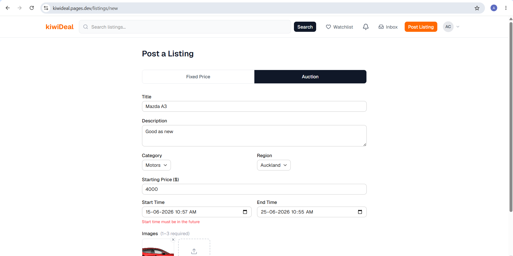
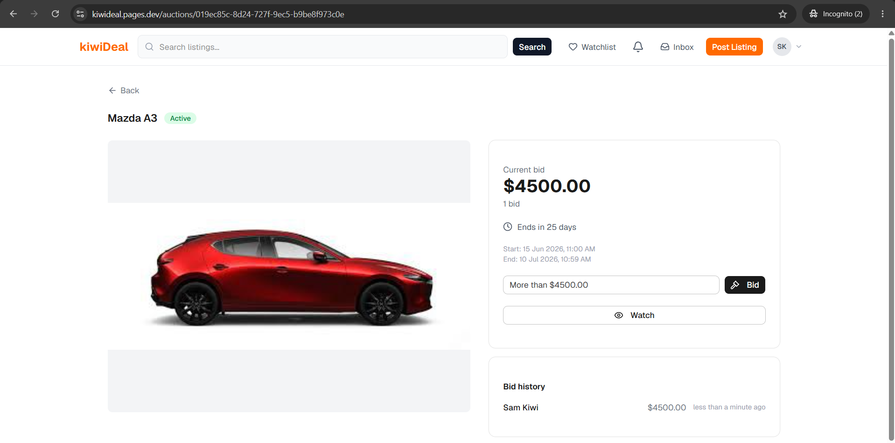
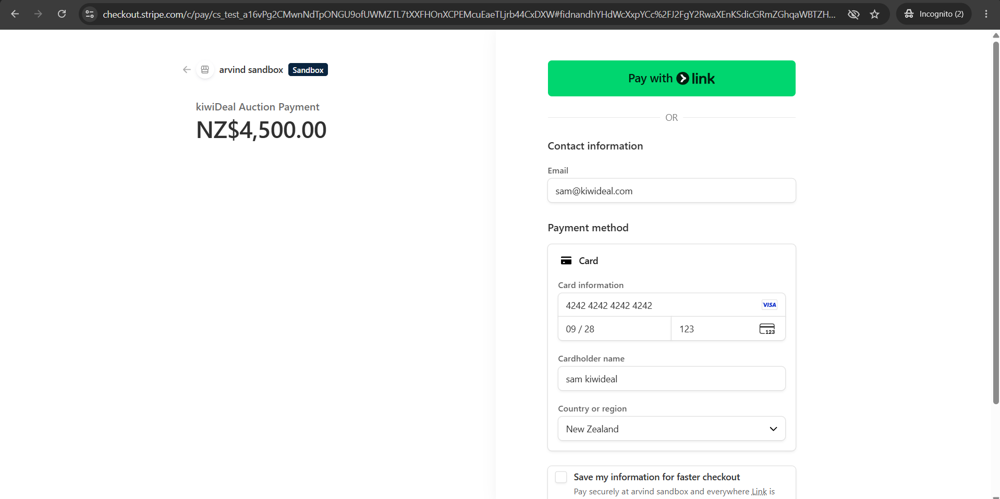
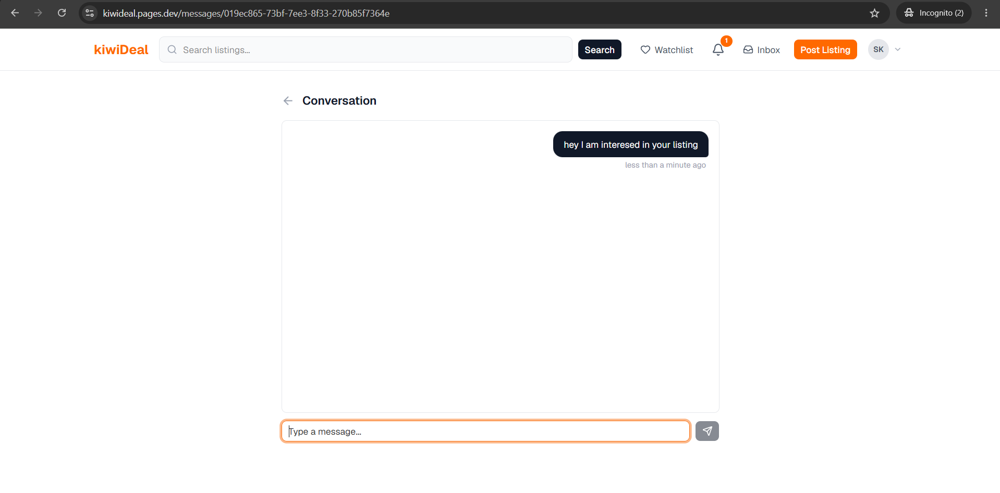
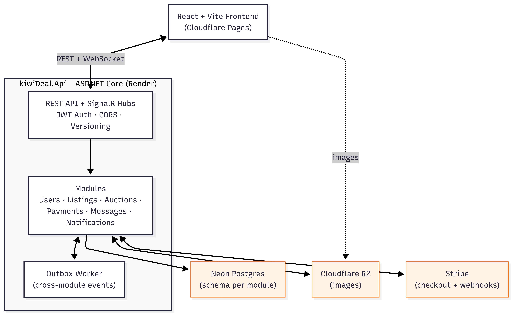

<p align="center">
  
</p>

<h1 align="center">kiwiDeal</h1>

<p align="center">
  A modern online marketplace for buying, selling, and auctioning goods across New Zealand.
</p>

<p align="center">
  <a href="https://kiwideal.pages.dev"><strong>🔗 Live Demo</strong></a> ·
  <a href="https://kiwideal-pqxq.onrender.com/scalar">API Docs</a>
</p>

<p align="center">
  <em>Note: the backend is hosted on Render's free tier and may take 30-60s to wake up on first request.</em>
</p>

---

## Overview

kiwiDeal is a full-stack marketplace platform combining fixed-price listings and live auctions. Sellers list items for a fixed price or run timed auctions with real-time bidding; buyers browse, bid, message sellers, and pay securely via Stripe — with live notifications throughout via SignalR.

The backend is a **.NET 10 modular monolith** — six independently structured modules (Users, Listings, Auctions, Payments, Messages, Notifications) sharing one deployable API, communicating via an outbox-based event pipeline.

---

## Features

- **Listings** — fixed-price or auction-style, up to 3 images, browse/search by category & region
- **Auctions** — real-time bidding via SignalR, scheduled auto-activation/closing, watchlist
- **Messaging** — direct buyer-seller chat with live inbox updates
- **Notifications** — live in-app alerts for bids, messages, payments
- **Payments** — Stripe Checkout, webhook-driven order status updates
- **Auth** — JWT access/refresh tokens, user ratings & reviews

---

## Screenshots

| Listings                                             | Live Bidding                                              |
| ---------------------------------------------------- | --------------------------------------------------------- |
|  |  |

| Checkout                                  | Live Messages & Notifications                                                      |
| ----------------------------------------- | ---------------------------------------------------------------------------------- |
|  |  |

---

## Tech Stack

**Backend** — .NET 10, MediatR, EF Core (Npgsql), FluentValidation, SignalR, JWT Auth, API Versioning + Scalar

**Frontend** — React 19 + Vite + TypeScript, TanStack Query, Tailwind + shadcn/ui, React Router, SignalR client, Axios

**Infrastructure** — Neon (Postgres), Cloudflare R2 (images), Stripe, Render (backend), Cloudflare Pages (frontend)

---

## Architecture

kiwiDeal is a **modular monolith**: one deployable app composed of independent modules, each with its own `Domain`, `Application`, `Infrastructure`, and `Api` layers. Modules don't call each other directly — they communicate through a shared **outbox**, keeping boundaries clean without microservice overhead.



---

## Getting Started (Local Development)

### Prerequisites

- [.NET 10 SDK](https://dotnet.microsoft.com/download)
- [Node.js 20+](https://nodejs.org/) and npm
- [Docker](https://www.docker.com/) (for local Postgres)

### 1. Start the database

```bash
docker-compose up -d
```

This starts a local Postgres instance (`localhost:5432`) with the per-module schemas pre-created via `scripts/init-schemas.sql`.

### 2. Configure backend secrets

The API reads configuration via .NET user-secrets (or environment variables) — never commit real secrets. Required keys are listed in [Environment Variables](#environment-variables) below.

```bash
dotnet user-secrets set "ConnectionStrings:UsersConnection" "Host=localhost;Port=5432;Database=kiwidealddb;Username=kiwiadmin;Password=kiwipassword;Search Path=users" --project src/kiwiDeal.Api
# ...repeat for each module's connection string, JWT settings, Stripe keys, R2 credentials
```

### 3. Apply database migrations

```bash
dotnet ef database update --project src/Modules/Users/kiwiDeal.Users.Infrastructure --startup-project src/kiwiDeal.Api --context UsersDbContext
# ...repeat for Listings, Auctions, Payments, Messages, Notifications
```

### 4. Run the backend

```bash
dotnet run --project src/kiwiDeal.Api
```

API available at `http://localhost:5158`, with interactive docs at `/scalar`.

### 5. Run the frontend

```bash
cd frontend
npm install
npm run dev
```

Frontend available at `http://localhost:5173`. Set `VITE_API_URL=http://localhost:5158/api/v1` in `frontend/.env.local` if not already configured.

---

## Environment Variables

| Variable                                                                 | Description                                                                                                 |
| ------------------------------------------------------------------------ | ----------------------------------------------------------------------------------------------------------- |
| `ConnectionStrings__{Module}Connection`                                  | Postgres connection string per module schema (Users, Listings, Auctions, Payments, Messages, Notifications) |
| `JwtSettings__Secret` / `Issuer` / `Audience` / `ExpiryMinutes`          | JWT signing config                                                                                          |
| `Stripe__SecretKey` / `WebhookSecret` / `SuccessUrl` / `CancelUrl`       | Stripe API key, webhook signing secret, redirect URLs                                                       |
| `R2__AccountId` / `AccessKey` / `SecretKey` / `BucketName` / `PublicUrl` | Cloudflare R2 credentials for image storage                                                                 |
| `AllowedOrigins`                                                         | CORS allowed origin (frontend URL)                                                                          |
| `VITE_API_URL` (frontend)                                                | Base URL of the backend API                                                                                 |

---

## Deployment

- **Backend** — deployed to [Render](https://render.com) as a Docker web service, built from the root `Dockerfile`
- **Frontend** — deployed to [Cloudflare Pages](https://pages.cloudflare.com), built from `frontend/` (`npm run build` → `dist`)
- **Database** — [Neon](https://neon.tech) serverless Postgres, one database with a schema per module
- **Images** — [Cloudflare R2](https://developers.cloudflare.com/r2/), public bucket for listing images
- **Payments** — [Stripe](https://stripe.com), with a webhook endpoint configured at `/api/v1/payments/webhook` for `checkout.session.completed` / `checkout.session.expired`

---

## Testing

```bash
# Unit tests
dotnet test tests/kiwiDeal.Tests.Unit

# Integration tests (spins up Postgres via Testcontainers)
dotnet test tests/kiwiDeal.Tests.Integration
```

Integration tests use [Testcontainers](https://testcontainers.com/) to run against a real Postgres instance — Docker must be running.
